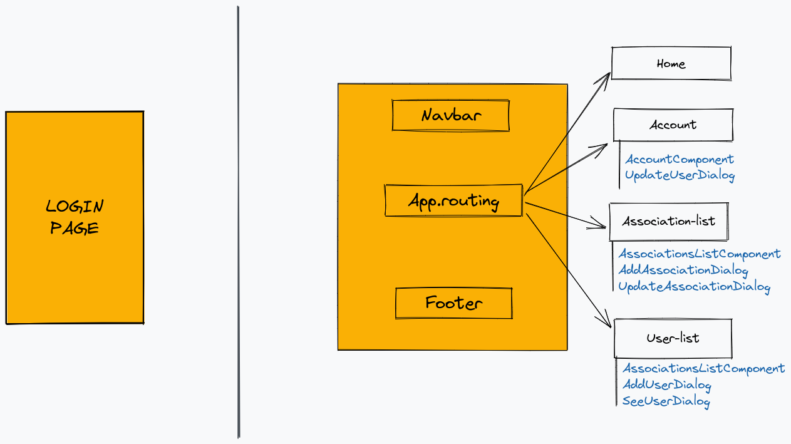

# FR - Administration
Ce projet de gestion d'administration a pour objectif de nous former sur le framework Angular.

Réalisé par Valentin Lorand et Guillaume Malherbe (étudiant ESIR3 - SI). 

Lien vers le répertoire GitHub : [https://github.com/Guitayk/FrontEnd-course]()

## Structure du projet
```
|-fr-administration-back : Partie backend du projet
|-fr-administration-front : Partie frontend du projet
|-images : Schémas du projet
```

## :rocket: Démarrer le projet

Lancement du backend :

```bash
cd fr-administration-back
npm install
npm start
```

Lancement du frontend :

```bash
cd fr-administration-front
npm install
npm start
```

## :microscope: Tester l'application Angular

### Tests unitaires
```bash
cd fr-administration-front
npm test
```
### Tests end to end avec cypress
```bash
cd fr-administration-front
npm install -d
npm run cypress
```

## :one: Partie Backend
Le backend de ce projet est développé sous NestJS en Javascript.
Une implémentation déjà faite nous a été fournie. Pour contourner quelques erreurs d'implémentation, nous avons été amené à apporter quelques modifications ci-dessous listées :

- Modification de la suppression d'un membre d'une association (passage par query au lieu du body) + uniformisation du code lignes 83-84.
- Récupération des rôles d'un utilisateur
- Pour la récupération des procès-verbaux, passage des paramètre en query au lieu du body + ajout d'une sécurité si absence d'un paramètre.

## :two: Partie Fronted
Le frontend est développé sous Angular 13.1.
L'implémentation a entièrement été réalisée par nous deux, nous allons détailler le fonctionnement de celui-ci.

Structure globale des pages :



Pour accéder aux différentes pages, il est nécessaire d'être connecté à l'application.
Pour se connecter il faut saisir l'id d'un utilisateur ainsi que son mot de passe associé. Ce n'est pas réellement un bonne pratique il faudrait que l'on puisse se connecter à l'aide d'un nom d'utilisateur mais le backend et la stucture de la base de données en place ne nous permet pas de changer cela.

Une fois connecté on accède à plusieurs fonctionnalités (elles sont listées sur la page d'accueil) :

- Accéder à son profil et mettre à jour ses informations.
- Lister les utilisateurs.
- Lister les associations.
- Modifier  les membres d'une association.
- Supprimer une association.
- Supprimer un utilisateur.
- Rechercher un utilisateur ou une association.
- Ajouter un utilisateur.
- Ajouter une association.
- Lister les rôles d'un utilisateur.

On peut accéder à l'ensemble des pages et des modals au travers de routes via l'API suivante :

  - '' : Page de connexion :unlock:
  - '/login' : Page de connexion :unlock:
  - '/account' : Page de compte :lock:
  - '/home' : Page d'accueil :lock:
  - '/users' : Liste des utilisateurs :lock:
  - '/users/create': Création d'un utilisateur :lock:
  - '/users/:id': Visualiser un utilisateur :lock:
  - '/associations': Liste des associations :lock:
  - '/associations/create': Création d'une association :lock:
  - '/associations/:name': Modifier une association :lock:


Nous avons fait le choix de mettre directement les composants des modales directement dans le fichier des composants des pages associés. Angular génère suffisament de fichier, nous avons jugé peu utile d'en ajouter sachant qu'ils se font pas plus de 300 lignes.